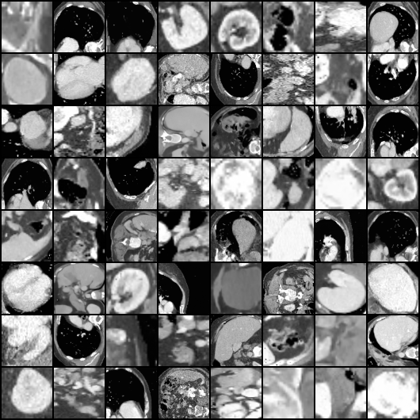
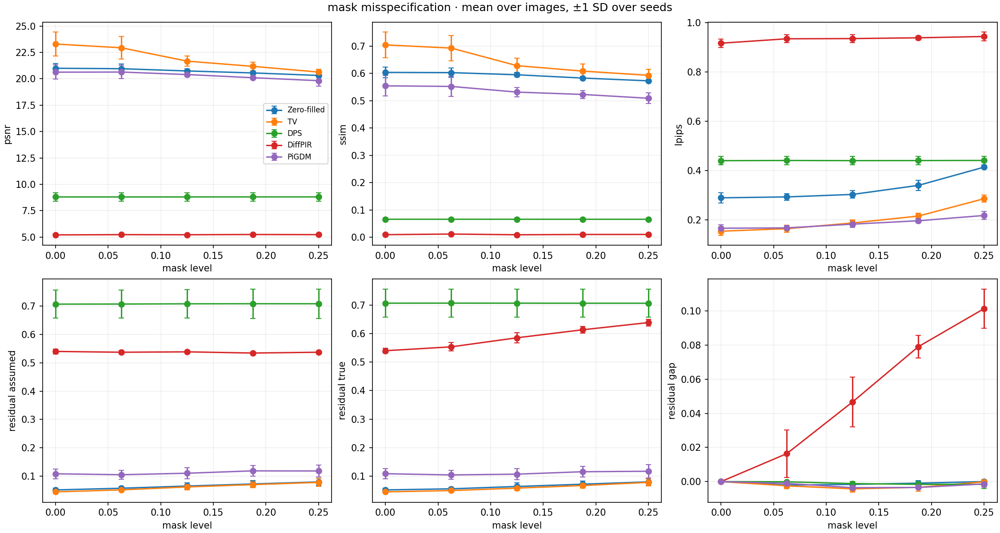
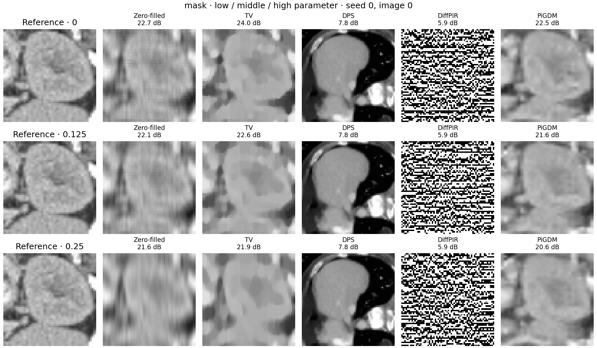
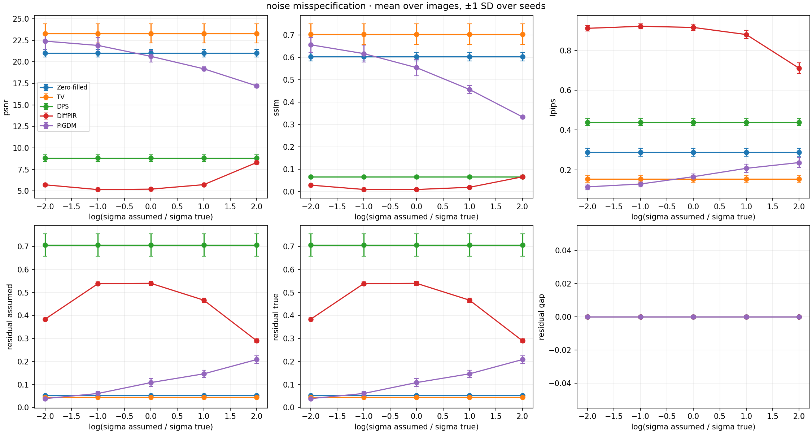
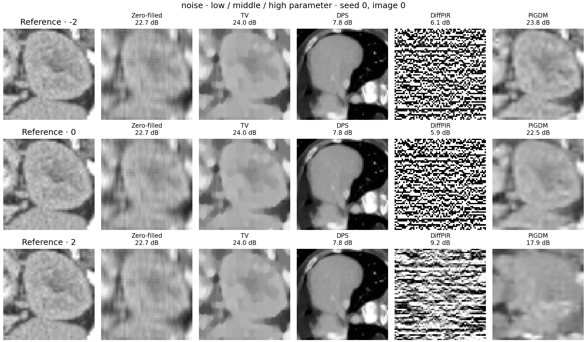
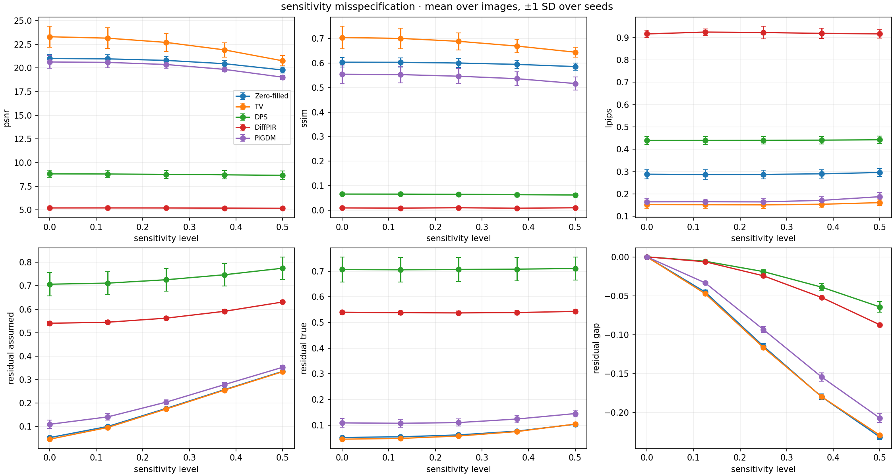
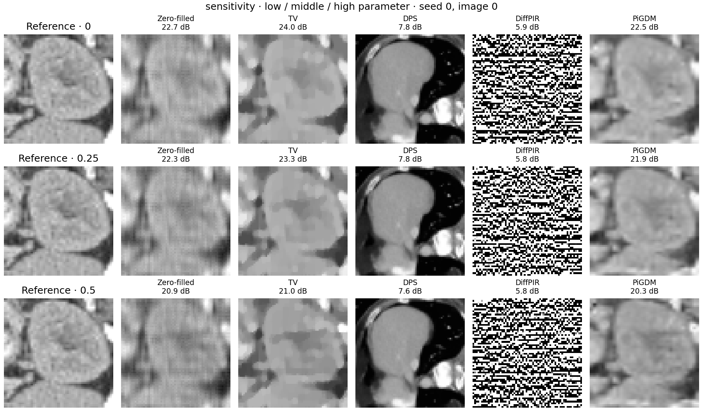

# Forward-model misspecification in diffusion inverse solvers

Benchmark of three diffusion inverse solvers (DPS, DiffPIR, PiGDM) against two classical
references (zero-filled Fourier reconstruction, isotropic TV) on simulated single-coil
Fourier measurements of OrganAMNIST64. Each solver receives an *assumed* forward operator
that differs from the *true* operator used to generate the measurements, along one of three
axes at a time: sampling mask, measurement noise level, and coil sensitivity. The prior is a
22.8M-parameter DDPM trained on the OrganAMNIST64 training split. Three of the five solvers
currently return broken reconstructions. Those failures are the subject of this repository.

## Results

Primary run: trained prior, 1800 rows (5 solvers x 3 axes x 5 levels x 8 test images x 3 seeds),
100 DDIM steps, $R=4$ with 8 ACS lines, true $\sigma = 0.03$. Config hash `d4edbcc9`, artifacts
under [`results/trained/`](results/trained/).

The prior passes its quality gate: FID 50.28 against 2000 validation images, held-out-vs-held-out
floor 16.41, noise-then-denoise PSNR 22.05 dB from timestep 250. Unconditional samples:

<p align="center"></p>

Matched forward model (every axis at level 0, mean over 24 runs):

| Method | PSNR (dB) | SSIM | LPIPS | Rel. residual |
| --- | ---: | ---: | ---: | ---: |
| Zero-filled | 21.00 | 0.604 | 0.289 | 0.052 |
| TV | 23.30 | 0.704 | 0.153 | 0.045 |
| DPS | 8.81 | 0.066 | 0.439 | 0.707 |
| DiffPIR | 5.21 | 0.009 | 0.916 | 0.540 |
| PiGDM | 20.63 | 0.554 | 0.165 | 0.109 |

The classical rows set the scale a working solver reaches here; the three diffusion rows are
diagnostics of the bugs below. Each axis then shows metrics against mismatch level (mean over
images, +-1 SD over seeds) and a qualitative grid at low, middle and high level, seed 0, image 0.

**Mask disagreement.**




**Noise misspecification.**




**Sensitivity misspecification.**




The frozen run in [`examples/smoke/`](examples/smoke/) is a **CIFAR-prior diagnostic**: borrowed
`google/ddpm-cifar10-32` tile adapter, 20 steps, one image, one seed. It is not a result.

## Known solver failures

Three open bugs, under investigation.

### DPS: the reconstruction does not depend on the measurement

**Symptom.** PSNR is 8.81 dB and pinned across every axis: 8.809 to 8.812 over the mask range,
8.809 at every noise level, 8.809 to 8.650 over the sensitivity range. Relative residual sits at
0.707 everywhere, the value expected when the output is uncorrelated with the data. Holding image
and seed fixed, the reconstruction moves 0.15% under 25% mask disagreement and 0.0000 under a
7.4x change in assumed $\sigma$.

**Evidence.** In the mask grid the DPS column is a sharp, anatomically plausible CT slice,
pixel-identical across all three levels, and it is the wrong slice. The prior is producing a
clean unconditional sample; the guidance term is inert.

**Suspected cause.** Two compounding defects in [`src/solvers/dps.py`](src/solvers/dps.py). The
`dps_loss: norm` default applies $\zeta \|r\|^{-1} \nabla \|r\|$ where
[Chung et al., Algorithm 1](https://arxiv.org/abs/2209.14687) applies
$\zeta \|r\|^{-1} \nabla \|r\|^2 = 2\zeta \nabla \|r\|$, so the step is smaller by $2\|r\|$ and
self-attenuates as $\|r\|$ grows, exactly when mismatch increases. Separately, `bounded_tweedie`
clamps $\hat{x}_0$ to $[-1,1]$ *inside* the autograd path (commit `3edb09d`); at the high-noise
end of the cosine schedule $\bar\alpha \approx 10^{-5}$ puts most pixels outside the clamp, where
the gradient is zero. The `norm` update also has no $\sigma$, forcing the noise axis flat.

### DiffPIR: the proximal update saturates the reconstruction

**Symptom.** PSNR 5.21 dB, SSIM 0.009, LPIPS 0.916. Output standard deviation is 0.484 against
0.149 for the reference; 42.5% of pixels fall below 0.05 and 47.7% above 0.95. The reconstruction
is near-binary.

**Evidence.** The DiffPIR column of every qualitative grid is salt-and-pepper. On the noise axis
PSNR *rises* from 5.16 dB to 8.30 dB and relative residual *falls* from 0.540 to 0.290 as assumed
$\sigma$ is overestimated: the reconstruction improves as the data term is down-weighted.

**Suspected cause.** In [`src/solvers/diffpir.py`](src/solvers/diffpir.py),
$\rho_t = \lambda \sigma^2 \bar\alpha_t / (1 - \bar\alpha_t)$ with $\lambda = 1$ and
$\sigma = 0.06$ in latent units gives $\rho_t < 10^{-3}$ over most of the schedule. At
$\rho_t \to 0$ the proximal solve in `FourierOperator.prox` discards $\hat{x}_0$ on every observed
frequency and returns the raw least-squares fit, far outside the prior's trained $[-1,1]$ domain at
high noise. `bounded_tweedie` then clamps it and the trajectory locks onto the clamp boundary.
Check the $\lambda$ default and the $\rho_t$ derivation first.

### PiGDM: guidance is over-damped

**Symptom.** PiGDM tracks anatomy but under-fits. At the matched operator its relative residual is
0.109 against 0.052 for zero-filling, and its output standard deviation is 0.128 against 0.149 for
the reference. On the noise axis PSNR falls monotonically from 22.40 dB at
$\log(\sigma_{\text{asm}}/\sigma) = -2$ to 17.20 dB at $+2$, SSIM from 0.657 to 0.334.

**Evidence.** The PiGDM noise curves are the only monotone diffusion curves in the set, and they
are best in the small-$\sigma$ limit, where the guidance denominator $r_t^2 \bar{M} + \sigma^2$ is
smallest and guidance is strongest. The qualitative columns are correct but blurred.

**Suspected cause.** The same clamp as DPS. `bounded_tweedie` sits inside the VJP path in
[`src/solvers/pigdm.py`](src/solvers/pigdm.py), so `torch.autograd.grad` returns zero wherever the
raw Tweedie estimate leaves $[-1,1]$. Guidance is then active only in the low-noise tail, after
global structure is fixed, producing both the residual excess and the variance deficit. The
latent-domain scaling of $\sigma$ in `covariance_backproject` is also unverified.

## Method

**Operator.** $A(x) = M \mathcal{F}(S \odot x)$, with centered orthonormal FFT, binary mask $M$ and
complex sensitivity map $S$. Images are real and single-channel. Measurements are full complex
grids, zero off the true mask; each measured real and imaginary component receives independent
$\mathcal{N}(0, \sigma^2)$ noise, so $\mathbb{E}|n|^2 = 2\sigma^2$. The complex adjoint is
$A^H y = \bar{S} \odot \mathcal{F}^{-1}(M \odot y)$ and the real reconstruction-space adjoint its
real part. Cartesian masks carry exactly $\mathrm{round}(64/R)$ lines including ACS. Samplers work
in signed coordinates $u = 2x - 1$, with $y_u = 2y - A(\mathbf{1})$ and $\sigma_u = 2\sigma$.

**Mismatch axes.** Only the true operator varies; the solver sees the assumed operator alone.

- **Mask.** The true mask is fixed; the assumed mask exchanges equal numbers of selected and
  unselected non-ACS lines. Level is the exact fraction of lines that disagree, in multiples of
  $2/64$, with changed sets nested across levels. Cartesian masks only.
- **Noise.** True $\sigma$ fixed, assumed $\sigma$ is $\sigma e^{\ell}$. Level 0 is exact.
- **Sensitivity.** True $S$ has a smooth polynomial phase and log-magnitude field scaled by the
  level; assumed $S \equiv 1$. DiffPIR's and PiGDM's closed forms require assumed $S \equiv 1$,
  which this axis respects: only the true $S$ varies.

Metrics report $\|A_{\text{asm}} x - y\| / \|y\|$, $\|A_{\text{true}} x - y\| / \|y\|$ and their
signed difference, all against the same full observed grid.

**Solvers.**

- **DPS**, [Chung et al. 2023, Eqs. (10) and (15), Algorithm 1](https://arxiv.org/abs/2209.14687).
  Residual gradient through the epsilon network after a DDIM step. Default `dps_loss: norm`; set
  `squared` for the paper's $\nabla\|r\|^2$.
- **DiffPIR**, [Zhu et al. 2023, Eq. (12b), Algorithm 1 lines 4-7](https://arxiv.org/abs/2305.08995).
  Proximal data step then noise blending, $\rho_t = \lambda \sigma^2 / \bar\sigma_t^2$. With
  $\bar{M}(k) = (M(k) + M(-k))/2$ the exact real minimizer is
  $\mathcal{F}z = (\mathcal{F}\,\mathrm{Re}\,A^H y + \rho \mathcal{F}x_0) / (\bar{M} + \rho)$,
  which reduces to the complex form only for conjugate-symmetric masks.
- **PiGDM**, [Song et al. 2023, Eqs. (7) and (8)](https://openreview.net/forum?id=9_gsMA8MRKQ).
  VJP guidance with $r_t^2 = (1-\bar\alpha_t)/\bar\alpha_t$, evaluated in real reconstruction
  space as $(r_t^2 A^*A + \sigma^2 I)^{-1} A^* r$: a Fourier division by $r_t^2\bar{M} + \sigma^2$.
- **Baselines.** Zero-filled adjoint; isotropic TV, 200 gradient iterations at weight 0.02.

## Reproduce

Python 3.10+ and a CUDA GPU. `prepare.py` fetches the MedMNIST archive, LPIPS and Inception
weights; no accounts or manual downloads. Train the prior on a Colab L4 with
`notebooks/train_colab.ipynb`, then sweep against the EMA checkpoint that passed the gate.

```bash
pip install torch==2.7.1 torchvision==0.22.1 --index-url https://download.pytorch.org/whl/cu126
pip install -r requirements.txt
python -m pytest -q
python scripts/prepare.py      --config configs/colab_trained.yaml
python scripts/check_prior.py  --config configs/colab_trained.yaml
python scripts/run_sweep.py    --config configs/colab_trained.yaml
python scripts/make_figures.py --config configs/colab_trained.yaml
```

Set `prior.checkpoint` to your checkpoint path. `check_prior.py` must report `PASS` before
`run_sweep.py` will run; re-running the sweep skips completed rows. `configs/colab.yaml` and
`configs/local.yaml` use the borrowed CIFAR prior and reproduce the diagnostic run only. Smoke
path, resume mechanics and dev setup: [`docs/development.md`](docs/development.md).

## Limitations

OrganAMNIST is CT, not MRI: k-space is simulated from magnitude images as a compressed-sensing
benchmark, not acquired from an MR scanner. The forward model uses a single synthetic coil, with no
coil combination, motion, non-Cartesian trajectory or learned sensitivity estimation. LPIPS and FID
are computed with natural-image networks and measure neither anatomical nor clinical validity.
Solver hyperparameters ($\zeta$, $\lambda$, `pigdm_scale`, TV weight) are library defaults and have
never been tuned.
